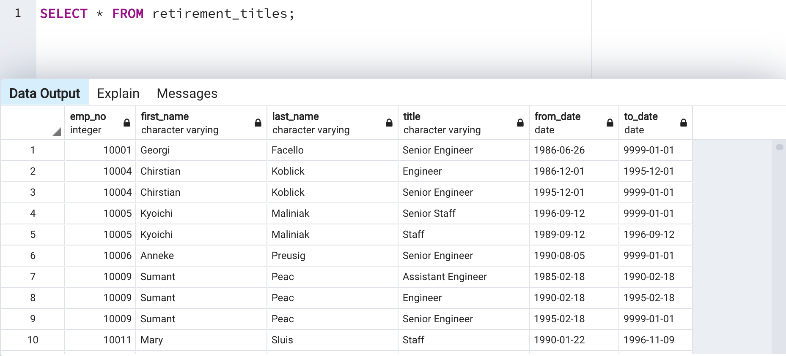
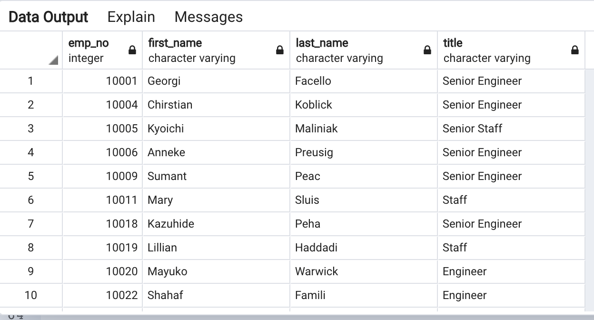
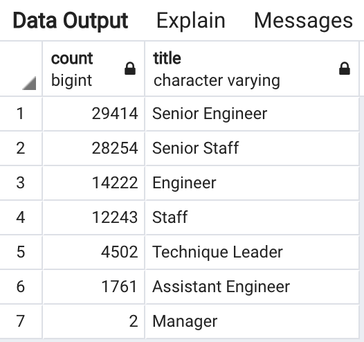
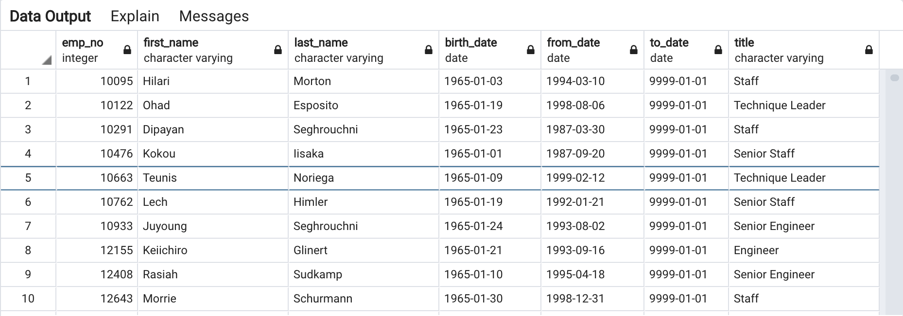

# Employee Database with SQL

## Overview of Project
Build employee database with SQL with the following tasks to complete for Pewlett Hackard.

1.	Determine the number of retiring employees per title
* Create a Retirement Titles table that holds all the titles of current employees who were born between January 1, 1952 and December 31, 1955. 
* It needs to use the DISTINCT ON statement to create a table that contains the most recent title of each employee. 
* Then, use the COUNT() function to create a final table that has the number of retirement-age employees by most recent job title.

2.	Identify employees who are eligible to participate in a mentorship program. 
* Create a mentorship-eligibility table that holds the current employees who were born between January 1, 1965 and December 31, 1965.

## Resources
- Data Sources: departments.csv, dept_emp.csv, dept_manager.csv, employees.csv, salaries.csv and titles.csv
- Software: PostgreSQL 12 and pgAdmin

## Results
Based on the database that was created, there are four major points on this analysis:

-	The retirement_titles table shows that there’s duplicate employee’s name due to their titles in which the employees may have been promoted. See below image.
 

-	The unique_titles table shows that it’s filtered the retirement_titles by using DISTINCT ON statement to retrieve the first occurrence of the employee number for each set of rows. See below image.

-	The retiring_table shows that the table has the number of retirement-age employees by most recent job title. See image below.

-	The mentorship_eligibilty table shows that it holds the current employees who were born between January 1, 1965 and December 31, 1965 and identifies employees who are eligible to participate in a mentorship program. See image below.

  

## Summary
